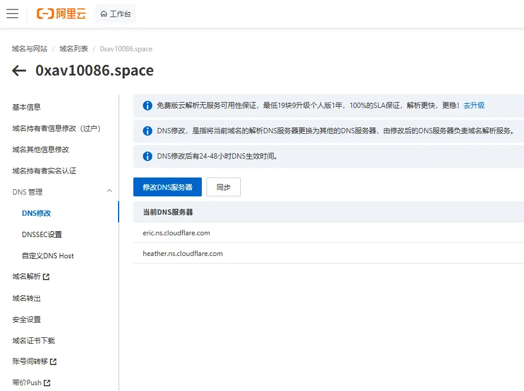

## 第一步：获取 Cloudflare 名称服务器

在操作阿里云之前，请确保你已经：

1. 在 [Cloudflare 官网](https://dash.cloudflare.com/) 点击 **Add a Site** 并输入你的域名。
    
2. 选择订阅计划（通常选 **Free** 即可）。
    
3. 扫描完成后，Cloudflare 会提供两个类似 `lina.ns.cloudflare.com` 和 `theo.ns.cloudflare.com` 的地址。**请复制并保存这两个地址。**
    

---

## 第二步：在阿里云修改 DNS 设置

由于阿里云控制台经常更新，这里是最新的导航路径：

1. **登录控制台**：进入 [阿里云域名控制台](https://dc.console.aliyun.com/)。
    
2. **定位域名**：在“域名列表”中找到你想要设置的域名。
    
3. **进入管理**：点击该域名右侧操作列的 **管理** 按钮。
    
4. **左侧菜单**：在左侧导航栏中，依次点击 **DNS 管理** > **DNS 修改**。
    
5. **修改服务器**：
    
    - 点击页面上方的 **修改 DNS 服务器**。
        
    - 在弹出的输入框中，删除原有的阿里云 DNS 地址。
        
    - 填入 Cloudflare 给你的那两个名称服务器地址（一次填一个，通常有两个框）。
        
6. **保存验证**：点击 **确认**。系统可能会要求你进行手机验证码或身份验证，完成后提交即可。

修改后的DNS服务器如下图所示：


---

## 第三步：等待生效

- **生效时间**：修改 DNS 服务器后，全球同步通常需要 **几分钟到 48 小时** 不等（大部分情况下 10 分钟内生效）。
    
- **检查状态**：回到 Cloudflare 控制台，点击 **Check nameservers**。当 Cloudflare 显示 "Great news! Cloudflare is now protecting your site" 时，说明设置成功。
    

---

### 💡 核心注意事项

- **原解析记录**：在修改 DNS 之前，确保 Cloudflare 已经正确同步（扫描）了你之前的 A 记录、CNAME 记录等。如果没同步完整，手动在 Cloudflare 中添加，否则会导致网站暂时无法访问。
    
- **DNSSEC**：如果你在阿里云开启了 DNSSEC 保护，**必须先在阿里云关闭它**，否则修改 DNS 服务器会导致解析彻底中断。

配置之后的Cloudflare的DNS记录如下图所示：


为了支持 HTTPS，最稳妥且主流的方法是先配置 HTTP，然后使用 **Certbot (Let's Encrypt)** 自动获取证书并升级到 HTTPS。

---

## 第四步：创建 Nginx 配置文件

在 Ubuntu/Debian 系统上，建议为每个站点创建独立的配置文件。执行以下命令：

```bash
# 创建并编辑配置文件
nano /etc/nginx/sites-available/0xav10086.conf
```

将以下内容粘贴进去（注意替换 `dash` 的代理配置）：

```Nginx
# 1. 博客主站 (静态文件)
server {
    listen 80;
    server_name www.0xav10086.space 0xav10086.space;

    root /var/www/blog;
    index index.html;

    location / {
        # 针对 Astro 等前端框架，优先匹配文件，匹配不到则返回 404
        try_files $uri $uri/ =404;
    }
}

# 2. Dash 子域名 (反向代理)
server {
    listen 80;
    server_name dash.0xav10086.space;

    location / {
        proxy_pass http://127.0.0.1:8686;
        proxy_set_header Host $host;
        proxy_set_header X-Real-IP $remote_addr;
        proxy_set_header X-Forwarded-For $proxy_add_x_forwarded_for;
        proxy_set_header X-Forwarded-Proto $scheme;
    }
}
```

---

## 第五步：启用配置并测试

1. **建立软链接**以启用配置：
    
    ```Bash
    ln -s /etc/nginx/sites-available/0xav10086.conf /etc/nginx/sites-enabled/
    ```
    
2. **测试 Nginx 语法**是否正确：
    
    
    ```Bash
    nginx -t
    ```
    
    如果显示 `syntax is ok` 和 `test is successful`，则重启 Nginx：
    
    
    ```Bash
    systemctl restart nginx
    ```
    

---

## 第六步： 配置 HTTPS (SSL 证书)

我们使用 Certbot 来自动化这个过程，它会自动修改你的 Nginx 文件并添加重定向。

1. **安装 Certbot**：
    
    
    ```Bash
    apt update
    apt install certbot python3-certbot-nginx -y
    ```
    
2. **获取并配置证书**：
    
    执行以下命令，Certbot 会自动识别你配置文件里的域名：
	
    
    ```Bash
    certbot --nginx -d 0xav10086.space -d www.0xav10086.space -d dash.0xav10086.space
    ```
    
    - **提示 1**: 会询问你的邮箱，用于接收证书过期提醒。
        
    - **提示 2**: 会询问是否自动将 HTTP 重定向到 HTTPS，建议选择 **2 (Redirect)**。
        

---

##  验证结果

现在你可以尝试在浏览器打开：

- `https://www.0xav10086.space` —— 应该看到你的 Fuwari 博客。
    
- `https://dash.0xav10086.space` —— 应该看到你 8686 端口的服务。
    
### 💡 避坑小贴士

- **防火墙**：确保你的 VPS 开启了 **80 (HTTP)** 和 **443 (HTTPS)** 端口。如果是阿里云/腾讯云，记得在安全组里放行。
    
- **域名解析**：确保你的 DNS 服务商那里已经把 `www`, `@` (根域名) 和 `dash` 都指向了你的 VPS IP。
    
- **权限**：如果访问报 403 错误，执行 `chmod -R 755 /var/www/blog` 确保 Nginx 有权读取文件。
    