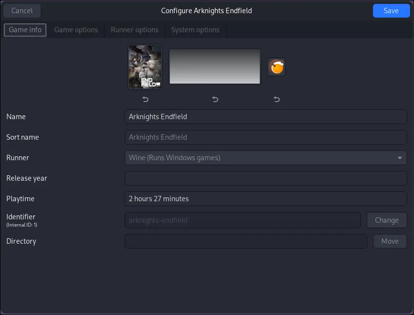
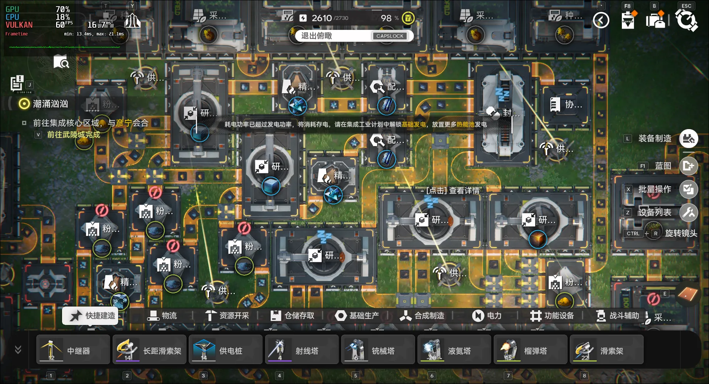

# 在 Arch Linux 上开启《终末地》之旅
## 前言：在 Arch Linux 上开启《终末地》之旅

本文假设你已经是一名 **Arch 糕手**，习惯了 `pacman` 的迅捷和 `hyprland` 的灵动，只是在面对《明日方舟：终末地》这类 Windows 大作时稍有疑惑。

虽然游戏原生运行在 Windows 环境，但在 Arch Linux 下通过合理的配置，理论上能获得更佳的“满血”体验，原因如下：

- **极简的系统开销：** 相比 Windows 臃肿的后台（遥测、Defender 实时扫描、强制更新），Arch 仅运行你需要的组件，将每一份 CPU 和内存资源都留给游戏 。
    
- **文件系统效率：** EXT4 或 Btrfs 在处理 Unity 引擎海量的小文件读写时，效率显著高于 Windows 的 NTFS。
    
- **原生 Vulkan 优势：** 《终末地》原生支持 Vulkan 接口。在 Linux 下，指令通过高质量驱动直接与显卡通信，绕过了 Windows 内部繁琐的显示驱动堆栈。
    
- **高级线程调度：** 借助 **Fsync**，Linux 内核能以远高于 Windows 标准调度器的效率处理游戏的多线程同步，有效缓解掉帧和卡顿 。

---

## 系统底层准备：打好“地基”

在安装任何游戏之前，你的系统必须具备处理 32 位指令、图形渲染和环境模拟的能力。

### 1. 开启 Multilib 仓库

绝大多数游戏及运行库都需要 32 位（lib32）支持。

1. 打开终端，编辑配置文件：
    
    ```bash
		sudo nvim /etc/pacman.conf
    ```
    
2. 找到以下两行，去掉前面的 `#` 注释符：
    
    ```Plaintext
	[multilib]
	Include = /etc/pacman.d/mirrorlist
    ```
    
3. 保存退出，并同步仓库：
    
    ```Bash
		yay -Syu
    ```

---

### 2. 安装显卡驱动 (GPU Drivers)

《终末地》对显卡性能要求较高，驱动必须完整且支持 Vulkan。

| **显卡类型**   | **必装核心包**               | **32 位兼容及 Vulkan 支持 (必装)**                                         |
| ---------- | ----------------------- | ------------------------------------------------------------------ |
| **NVIDIA** | `nvidia` `nvidia-utils` | `lib32-nvidia-utils` `vulkan-icd-loader` `lib32-vulkan-icd-loader` |
| **AMD**    | `mesa`                  | `lib32-mesa` `vulkan-radeon` `lib32-vulkan-radeon`                 |
| **Intel**  | `mesa`                  | `lib32-mesa` `vulkan-intel` `lib32-vulkan-intel`                   |

> **提示：** 如果你是双显卡笔记本（核显+独显），建议安装 `nvidia-prime` 或 `bumblebee`。

---

### 3. 安装 Wine 及其全家桶

Wine 是运行 Windows 程序的灵魂。虽然 Lutris 会自带运行器，但系统原生安装一些核心依赖可以避免 99% 的闪退问题。

执行以下命令安装 **Wine-Staging**（测试版，对游戏支持更好）：

```Bash
yay -S wine-staging giflib lib32-giflib libpng lib32-libpng libldap lib32-libldap gnutls lib32-gnutls mpg123 lib32-mpg123 libxml2 lib32-libxml2 libpulse lib32-libpulse alsa-plugins lib32-alsa-plugins
```

在 Arch Linux 的世界里，我们崇尚“最小化安装”和“手动控制”。虽然 Lutris 会自带运行器，但如果不安装系统级的依赖库，你可能会遇到游戏有画面没声音、起动器登录不上、或者干脆直接黑屏等各种离谱问题 。

你可以把这一长串 `yay` 命令看作是给你的 Wine 准备一套**全能工具箱**。以下是必须安装它们的硬核理由：

---

#### 1. 32 位兼容性（lib32 系列）

- **理由：** 绝大多数 Windows 游戏的底层组件、起动器或反作弊插件依然在使用 32 位架构 。
    
- **后果：** 如果不装这些，Wine 在尝试拉起 32 位进程时会直接报错退回终端 。
    

#### 2. 图像与多媒体解码（giflib, libpng, mpg123）

- **理由：** 游戏中的 UI 图标、过场动画和背景音乐通常是经过压缩的（如 PNG 图片或 MP3 音频）。
    
- **后果：** 缺少这些库，你可能会看到满屏的“方块粉红贴图”，或者在砍怪时听不到任何音效。
    

#### 3. 网络安全与通信（gnutls, libldap）

- **理由：** 现代游戏（尤其是《终末地》这种二游）的起动器本质上是个浏览器，需要通过 HTTPS（加密连接）与服务器验证账号。
    
- **后果：** 缺少 `gnutls`，你的起动器可能永远显示“无法连接服务器”或“登录超时”。
    

#### 4. 音频渲染（libpulse, alsa-plugins）

- **理由：** Windows 发出的音频信号需要被翻译给 Linux 的音频服务器（如 PulseAudio 或 PipeWire）。
    
- **后果：** 没了它们，你的音箱就是个摆设。
    

#### 5. 系统底层设施（libxml2）

- **理由：** 用于解析各种 XML 格式的配置文件和注册表项。
    
- **后果：** 可能导致 Wine 无法正确读取游戏路径或用户设置。
    

---

> **一句话理由：** > Wine 只是一个“翻译官”，而这些库是它翻译时必须查阅的“词典” 。原生安装这些库能让系统优先调用 Arch 高性能的系统库，而不是 Lutris 容器里那些通用的旧版本，从而降低延迟并避免 99% 的闪退 。

---

### 4. 安装 Lutris

既然我们要使用 Lutris，请务必安装官方仓库版本，而非 Flatpak 版本，以获得最佳的系统访问权限。

```Bash
yay -S lutris
```

---

### 5. 下载游戏启动器

访问 [终末地官网](https://endfield.hypergryph.com/)下载PC启动器，将下载下来的`HypergryphLauncher_1.0.0_1_1_endfield.exe`程序先放在合适的文件夹中，我这里放置在了 `~/Games/Endfield`

### 6. 使用 ProtonPlus 安装 dwproton

在正式配置 Lutris 之前，我们需要获取关键的运行器：**dwproton**（专门针对 ACE 等反作弊系统优化的版本） 。

1. **安装 ProtonPlus：**
    ```bash
    yay -S protonplus-bin
    ```
    
2. **获取 dwproton：**
    
    - 打开 **ProtonPlus**，在界面中找到 **Lutris** 选项卡。
        
    - 点击添加按钮，在列表中搜索并下载 **`dwproton-10.0-16`** 或更高版本。
        
    - 该工具会自动将运行器放置在 Lutris 能够识别的路径。

### 7. 补充：必要的英文字体

许多 Windows 程序在 Linux 下会因为找不到默认字体（如 Arial）而导致界面乱码或报错。

```bash
yay -S ttf-liberation ttf-ms-fonts
```

_(注：`ttf-ms-fonts` 可能需要通过 AUR 安装，如 `yay -S ttf-ms-fonts`)_

---

## Lutris 核心配置详解

Lutris 的核心配置决定了游戏能否顺利“越过”反作弊系统并满血运行。以下是基于 `dwproton` 环境的详细步骤。

### 1. 建立虚拟 C 盘 (Wine Prefix)

Lutris 的核心优势是环境隔离，即为《终末地》创建一个专属文件夹 。

- 点击 Lutris 左上角 **“+”** -> **Install a Windows game from an executable** 。
    
- **Executable**：选择你下载好的 ``～/Games/Endfield/HypergryphLauncher_1.0.0_1_1_endfield.exe``。
    
- **Wine prefix**：选择一个专门的文件夹（如 `~/Games/Endfield`） 。
    
- 安装完成后，在登陆器中正常下载游戏资源。
---

### 2. 运行环境配置 (Runner Options)

这是决定《终末地》能否运行的关键页面，特别是针对我们使用的 **dwproton** 。

- **Wine version (运行器版本)**：手动选择 `dwproton-10.0-16`或更新的版本 。该版本专门针对国产游戏的反作弊机制（如 ACE）进行了内核级优化 。
    
- **Enable Esync/Fsync**：确保这两个开关全部 **开启 (On)** 。在 Arch Linux 下，Fsync 能显著提升 CPU 效率并减少掉帧 。
        
- **Enable DXVK**：即使游戏支持原生 Vulkan，建议依然保持 **开启**，以确保基于 DirectX 的启动器界面能够正常显示 。

---

### 3. 系统优化设置 (System Options)

为了保证游戏过程中的稳定性和性能，需要对系统行为进行微调 。

- **Prefer system libraries**：开启此项。Lutris 会优先调用你通过 `yay` 安装的高性能系统库，而不是自带的旧版兼容库 。
    
- **FPS counter (MangoHud)**：在此处开启开关即可在游戏内显示实时帧率、温度及显存占用 。
    
- **Disable screen saver**：开启。防止在游玩过程中（尤其是使用手柄时）系统自动进入休眠或黑屏 。

---





---

## 常见的“玄学”兼容性设置

如果游戏启动没反应或运行异常，通常可以通过以下 **DLL Overrides** 解决：

| **键 (Key)**           | **值 (Value)**     | **作用**                       |
| --------------------- | ----------------- | ---------------------------- |
| `winemenubuilder.exe` | `Disabled`        | 防止 Wine 在 Linux 系统菜单生成冗余快捷方式 |
| `mbedtls`             | `native, builtin` | 解决部分国产游戏起动器的网络连接或加密问题        |
| `d3dcompiler_47`      | `native`          | 解决 Unity 引擎游戏的着色器编译错误        |

---

## 性能监控与显示 (MangoHud)

在 Lutris 中开启帧率显示非常直观：

1. **系统级安装：** 通过 `yay -S mangohud lib32-mangohud` 安装。
    
2. **Lutris 开启：** 在游戏的 **System options** 选项卡中，开启 **FPS counter** 开关。
    
3. **自定义：** 使用 `goverlay` 工具可视化调整监控面板的位置、颜色和显示指标。
  
---

## 总结：稳定的运行逻辑

1. **环境隔离：** 每个游戏拥有独立的 Wine Prefix。
    
2. **依赖补齐：** 在 Lutris 界面通过 **Winetricks** 或 **Dependencies** 页面安装 `vcredist` 等必备组件。
    
3. **权限透明：** 如果是 Arch 用户，尽量使用系统原生安装的 Lutris，以避免 Flatpak 沙盒带来的路径访问权限问题。


# 参考资料
[明日方舟：终末地性能分析：二游画质巅峰？榨干手机！]( https://www.bilibili.com/video/BV1RgzpBHEQG/)
[【教程】Linux玩终末地]( https://www.bilibili.com/video/BV1WAkLBREk2/)
[【终末地帧数对比】Linux比Win帧数更高？]( https://www.bilibili.com/video/BV1LYzWBxEc8/)